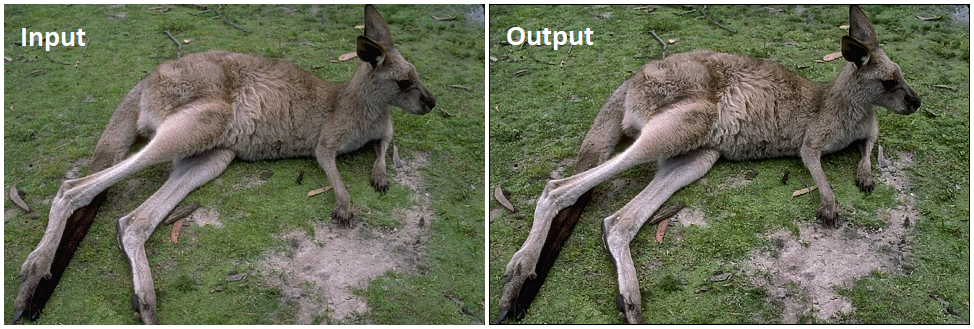
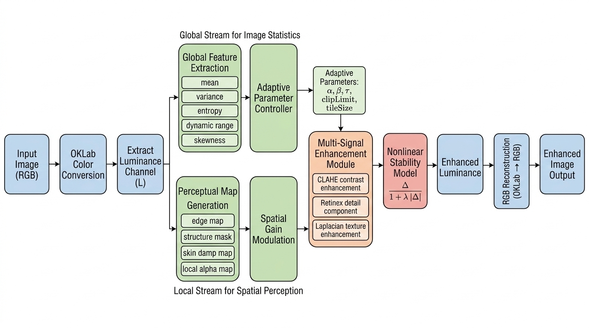

# 🚀 Perceptual Adaptive Contrast Enhancement (PACE)

> A perception-aware luminance enhancement framework for improving image visibility while preserving structural fidelity and natural color appearance.

---

## 🔗 Links
[](paper/Perceptual_Adaptive_Contrast_Enhancement_(PACE).pdf)
[](https://github.com/muhammedshahid/pace)
[](https://muhammedshahid.github.io/pace/)

---

## 🖼️ Visual Comparison

<p align="center">
  
</p>

> Comparison between Original and PACE-Enhanced Images.

---

## 📌 Overview

**PACE (Perceptual Adaptive Contrast Enhancement)** is a luminance-based image enhancement framework designed to:

- Improve visibility in low-contrast and challenging lighting conditions  
- Preserve structural consistency and spatial relationships  
- Maintain natural color appearance without chromatic distortion  

Unlike traditional histogram-based or Retinex-based methods, PACE achieves a **balanced enhancement** by integrating perceptual and structural constraints.

---

## ⚙️ Method Pipeline

<p align="center">
  
</p>

The framework operates in a perceptually uniform color space and applies adaptive enhancement only on the luminance channel.

---

## 📊 Experimental Results

| Method | MSE ↓ | PSNR ↑ | SSIM ↑ | Entropy ↑ | CII ↑ | NIQE ↓ | BRISQUE ↓ | PIQE ↓ |
|--------|------|--------|--------|----------|----------|----------|----------|----------|
| HE     | 0.0500 | 15.58 | 0.6485 | 10.90 | **1.601** | 3.694 | 22.042 | 41.876 |
| CLAHE  | 0.0229 | 17.26 | 0.7611 | 13.65 | 1.282 | 3.090 | 14.688 | 34.947 |
| LIME   | 0.0510 | 13.09 | 0.7923 | **15.05** | 0.821 | **2.877** | 13.649 | **29.965** |
| MSRCR  | 0.1120 | 9.78  | 0.6573 | 13.43 | 0.399 | 3.417 | **6.792**  | 30.143 |
| **PACE** | **0.0043** | **23.93** | **0.9223** | 14.56 | 1.082 | 3.191 | 12.091 | 39.838 |

✔ PACE achieves:
- **Lowest reconstruction error (MSE)**
- **Highest reconstruction quality (PSNR)**
- **Highest structural similarity (SSIM)**
- **High richness of information/details in the image (Entropy) without introducing noise**
- **Balanced information enhancement**

---

## ⚠️ Insight: Metric Limitations

Although no-reference metrics (NIQE, BRISQUE, PIQE) are widely used:

- LIME and MSRCR often obtain **better scores**
- But produce **chromatic instability and washed-out details**

👉 This highlights a key limitation:
> Objective perceptual metrics do not always align with human visual perception.

PACE is designed to **balance perceptual quality with structural fidelity**, resulting in more stable visual outputs.

---

## 📄 Paper

📥 Download full paper:  
👉 [PACE – Perceptual Adaptive Contrast Enhancement](paper/Perceptual_Adaptive_Contrast_Enhancement_(PACE).pdf)

---

## 📁 Repository Structure

```bash
PACE-Research-Paper/
├── README.md
├── paper/
│   └── Perceptual_Adaptive_Contrast_Enhancement_(PACE).pdf
├── figures/
│   ├── comparisons.png
│   └── pipeline.png
└── LICENSE

---

## 🚀 Future Work

- Deep learning integration  
- Real-time video enhancement

---

## 📬 Contact

For research collaboration or queries, feel free to connect.

---

## ⭐ Citation

```bibtex
@misc{pace2026,
  title={Perceptual Adaptive Contrast Enhancement (PACE)},
  author={Mohd. Shahid},
  year={2026}
}
